# 🧠 Persistent AI Memory Engine using Oracle Autonomous AI Database

> **Technical Blueprint & Development Logic** | AMD Slingshot Hackathon 2026

## 📑 Overview
The **Persistent AI Memory Engine** is a long-term context retention system that allows the SkillDashboard AI to behave as a **Continuous Educator**. Instead of treating every chat as a blank slate, this engine creates a permanent, course-specific knowledge vault for every student.

---

## 🛠️ The Build: How We Created This
To understand the engine, it is important to look at the **Process Logic** we used to bridge the gap between volatile chat sessions and permanent database storage.

### 1. The Multi-Agent Orchestration
We built a specialized **LangGraph Orchestrator** in the SkillDashboard backend. Its primary job is **Contextual Routing**:
- It identifies which `course_id` the student is currently in.
- It queries the **Oracle Autonomous Database** to pull "Historical Friction Points" (concepts the student struggled with previously).
- It injects this history into the LLM system prompt.

### 2. High-Performance Vectorization
We leverage **AMD Instinct™ MI300X** hardware for the "Embedding Pass." When a student types a query, the text is converted into a 1536-dimensional vector. Because of AMD's **192GB HBM3 memory**, we can hold large batches of these interaction vectors in-memory for instant similarity comparisons.

---

## 🏗️ Connectivity Architecture & Logic

This section breaks down the logical flow from the user's dashboard to the physical hardware in the Oracle Cloud.

### 🔗 Execution Flowchart

```mermaid
graph TD
    A[👨‍🎓 Student: 'How do I optimize my previous code?'] --> B[SkillDashboard Frontend]
    B --> C[� LangGraph Orchestrator]
    
    subgraph "The Intelligence Layer"
        C --> D{Context Manager}
        D -->|Fetch Long-term Memory| E[("💾 Oracle 23ai<br/>AI Vector Search")]
    end
    
    subgraph "AMD Hardware Acceleration"
        E -->|Course-ID Partitioned Vectors| F[⚡ AMD Instinct™ MI300X]
        F -->|Semantic Similarity Matching| G[Augmented Prompt Buffer]
    end
    
    G --> H[🤖 LLaMA-3 70B Response]
    H --> I[👨‍🎓 Student Receives Personalized Guidance]
```


### 🧠 Logic Behind Connectivity:
- **The Bridge**: The `useEducationalIntelligence` hook acts as the gatekeeper, passing unique `student_id` and `course_id` tokens with every request.
- **Why Oracle?**: We use Oracle AI Vector Search because it allows us to store vectors **directly next to** standard student data. There is zero latency moving data between a vector database and a SQL database.
- **Why AMD?**: The **MI300X** handles the heavy inference load. By using OCI's high-speed fabric, we ensure that the "retrieved memory" reaches the LLM in milliseconds, even if the student has a history spanning months.

---

## 💾 Memory-Side Architecture (The Internals)

The heart of the system is the **Isolated Course Memory Container**. This is a logical partition that ensures privacy and pedagogical consistency.

### 🧊 Logical Internal Layers:
Within the Oracle Database, each course container follows this hierarchical flow:

1.  **Layer 1: The Vector Store (Retentive Root)**:
    - *Purpose*: Stores the mathematical representation of "What was discussed."
    - *Hardware Optimization*: Tuned for **AMD EPYC™** cache structures to ensure the distance calculations (similarity checks) are CPU-efficient.

2.  **Layer 2: Historical Friction Registry**:
    - *Purpose*: A structured log of "Concepts requiring reinforcement."
    - *Logic*: If a student failed a Viva on "Binary Trees" last week, this layer flags it so the Socratic Coach can bring it up again today.

3.  **Layer 3: The Tone Lock (Teaching Style)**:
    - *Purpose*: Maintains the "AI Personality" for the specific course.
    - *Consistency*: Ensures the mentor doesn't switch from "Strict Marketer" to "Friendly Coder" mid-semester.

---

## 🔧 Deep Integration: Code & SQL Logic

### 1. Database Initialization (Oracle 23ai)
We initiate the persistent layer using a converged schema:
```sql
-- Creating the Course Memory Vault
CREATE TABLE persistent_vault (
    interaction_id NUMBER GENERATED ALWAYS AS IDENTITY,
    course_id VARCHAR2(100), -- The Isolation Key
    student_record CLOB,
    context_vector VECTOR(1536, FLOAT32), -- Optimized for AMD Compute
    friction_score NUMBER(3,2), -- Tracking learning difficulty
    CONSTRAINT pk_vault PRIMARY KEY (interaction_id)
) INMEMORY; -- Enabling In-Memory for ultra-fast vector retrieval
```

### 2. The Retrieval Logic (Backend)
The backend doesn't just "ask" the AI; it **remembers** first:
```javascript
async function askWithMemory(userInput, courseId) {
    // 1. Fetch relevant memories via Oracle Vector Search
    const userMemory = await db.query(`
        SELECT student_record 
        FROM persistent_vault 
        WHERE course_id = :courseId 
        ORDER BY VECTOR_DISTANCE(context_vector, :inputVec, COSINE) 
        LIMIT 5
    `, { courseId, inputVec: embed(userInput) });

    // 2. Build the "Augmented Prompt"
    const finalPrompt = `
        The student has a history of: ${userMemory.join('. ')}
        Current Input: ${userInput}
        Maintain the established Course Tone.
    `;

    // 3. Execute on AMD MI300X
    return await llm.generate(finalPrompt);
}
```

---

## 🌟 Why This Approach is Unique
- **Continuous Educator**: Moves beyond single-session chat. It builds a "teacher-student bond" over time.
- **Performance-First**: specifically architected to leverage **AMD's High Bandwidth Memory** to solve the "context bottleneck" common in long-term AI interactions.
- **Oracle-Native**: No third-party vector databases. Everything is secure, managed, and autonomous.
